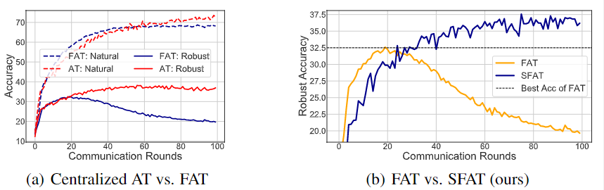
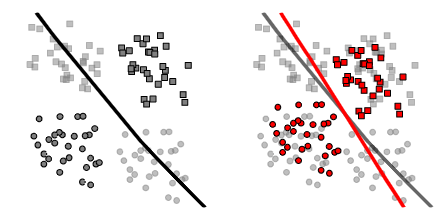
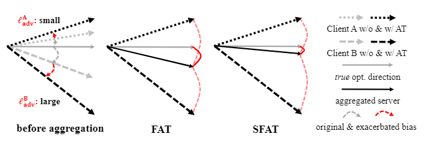
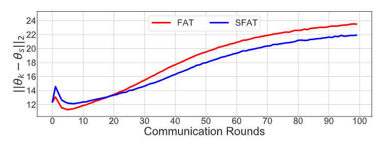

<h1 align="center">SFAT: Slack Federated Adversarial Training</h1>
<p align="center">
    <a href="https://openreview.net/forum?id=eKllxpLOOm"></a>
    <a href="https://github.com/ZFancy/SFAT"></a>
    <!-- <a href="https://colab.research.google.com/drive/1t0_4BxEJ0XncyYvn_VyEQhxwNMvtSUNx?usp=sharing"></a> -->
    <a href="https://openreview.net/forum?id=eKllxpLOOm">  </a>
    <a href="https://github.com/ZFancy/SFAT/blob/main/license">  </a>
    <!-- <a href="https://neurips.cc/virtual/2022/poster/54643"> </a> -->
    <!-- <a href="https://lfhase.win/files/slides/CIGA.pdf"> </a> -->
   <!--  <a href="https://icml.cc/media/PosterPDFs/ICML%202022/a8acc28734d4fe90ea24353d901ae678.png"> </a> -->
</p>

This repo contains the sample code of our proposed framework ```Slack Federated Adversarial Training (SFAT)``` in our paper: [Combating Exacerbated Heterogeneity for Robust Models In Federated Learning](https://openreview.net/forum?id=eKllxpLOOm) (ICLR 2023).

TODO:

- [ ] Update the Project Page of SFAT.
- [ ] Update the Presentation [Slides]() and [Video]().
- [x] Released the early version of sample code.

### TLDR

Our SFAT assigns the client-wise slack during aggregation to combat the intensified heterogeneity, which is induced by the inner-maximization of adversarial training on the heterogeneous data in federated learning.

## Introduction 

The emerging privacy and security issues in real-world applications motivate us to pursue the adversarially robust federated models. However, the straightforward combination between adversarial training and federated learning in one framework can induce the undesired robustness deterioration.

<p align="center"></p>
<p align="center"><em>Figure 1.</em> Robust Deterioration in federated adversarial training.</p>

We dive into the issue of robustness deterioration and discover that it may attribute to the intensified heterogeneity induced by adversarial training in local clients. Considering federated learning, one of the primary difficulties is the biased optimization caused by the local training with heterogeneous data. As for adversarial training, the key distinction from standard training is the use of inner-maximization to generate adversarial data, which pursues the better adversarial robustness. When combining the two learning paradigms, we conjecture that the following issue may arise especially under the Non-IID case,

<p align="center"><i>the inner-maximization for pursuing adversarial robustness would exacerbate the data heterogeneity among local clients in federated learning.</i></p>

<p align="center"></p>
<p align="center"><em>Figure 2.</em> Illustration of $\alpha$-slacked mechanism.</p>

## Quick preview of our SFAT

### Environment
```
Python (3.8)
Pytorch (1.7.0 or above)
torchvision
CUDA
Numpy
```

### File Structure

```
./SFAT-main
├─ Centralized_AT.py        # Training and evaluation
├─ SFAT.py
├─ attack_generator.py
├─ eval_pgd.py
├─ logger.py
├─ models.py
├─ options.py               # Options and hyperparameters
├─ readme.md
├─ sampling.py              # Data split
├─ update.py
└─ utils.py                 # Aggregation and other utils
```

### Running example

To train federated robust model, we provide examples below to use our code:

~~~bash
CUDA_VISIBLE_DEVICES='0' python SFAT.py --dataset=cifar-10 --local_ep=10 --local_bs=32 --iid=0 --epochs=100 --num_users=5 --agg-opt='FedAvg' --agg-center='FedAvg' --out-dir='../output_results_FAT_FedAvg'


CUDA_VISIBLE_DEVICES='0' python SFAT.py --dataset=cifar-10 --local_ep=10 --local_bs=32 --iid=0 --epochs=100 --num_users=5 --agg-opt='FedAvg' --agg-center='SFAT' --pri=1.2 --out-dir='../output_results_SFAT_FedAvg'
~~~

<p align="center"></p>
<p align="center"><em>Figure 3.</em> Comparison of FAT and SFAT using approximated client drift.</p>

Compared with FAT, our proposed SFAT selectively upweights/downweights the client with small/large adversarial training loss to alleviate it during aggregation, which follows our $\alpha$-slack mechanism to relax the original objective into a lower bound. SFAT can a smaller drift compared to FAT, i.e., a less heterogeneous aggregation, by adapting $\alpha$-slack mechanism.

### Realization details

Following the conventional federated learning realization, we realizes the overall framework of ```SFAT``` in ```SFAT.py``` which coordinate the local optimization part in ```update.py``` and the aggregation functions in ```utils.py```.

In ```SFAT.py```, we get the local model in each client and aggregate the global model.

~~~python
# local updates
for idx in idxs_users:
    local_model = LocalUpdate(args=args, dataset=train_dataset, idxs=user_groups[idx], logger=logger, alg=args.agg_opt, anchor=global_model, anchor_mu=args.mu, local_rank=ipx, method=args.train_method)
            ''' ''' 
# aggregation method
if args.agg_center == 'FedAvg':
    global_weights = average_weights(local_weights)
if args.agg_center == 'SFAT':
    ''' '''
    global_weights = average_weights_alpha(local_weights, idt, idtxnum, args.pri)
~~~

In ```updates.py```, we realize the local training on each client for adversarial training and defined the ```LocalUpdate()```.

In ```utils.py```, we realize the aggregation methods and define the FAT, i.e., ```average_weights()``` and SFAT ```average_weights_alpha()``` as well as their unequal versions. For the our SFAT, the critical part of code is as follows, where the ```lw``` and ```idx``` is to help choose the corresponding clients and the ```p``` is our $\alpha$-slack parameter for reweighting.

### Data split 

We realize the operation of data split in ```sampling.py``` and utilized in ```utils.py``` for generate local data loader for each client. We can use our pre-defined split function as following to get the local data.

~~~python
def get_dataset(args):
    ''' ''' 
    user_groups = cifar_noniid_skew(train_dataset, args.num_users)
    ''' '''
    return train_dataset, test_dataset, user_groups
~~~

### Choosing different optimization and aggregation methods

To choose different federated optimization methods (e.g., FedAvg, FedProx, Scaffold) and the aggregations (e.g., FAT and SFAT) for training robust federated model. We can used defined parameter in our ```options.py```:

~~~python
parser.add_argument('--agg-opt',type=str,default='FedAvg',help='option of on-device learning: FedAvg, FedProx, Scaffold')
parser.add_argument('--agg-center',type=str,default='FedAvg',help='option of aggregation: FedAvg, SFAT')
~~~

### Evaluation

To evaluate our trained model using various attack methods, we provide the ```eval_pgd.py``` contains different evaluation metrics for natural and robust performance. You can run the following script with your model path to conduct evaluation:

~~~bash
CUDA_VISIBLE_DEVICES='0' python eval_pgd.py --net [NETWORK STRUCTURE] --dataset [DATASET] --model_path [MODLE PATH]
~~~

Actually, during the training, we also provide the accuracy track via ```logger.py``` to save the model performance in each epoch.

### To extend and design new method in our framework

Either the local optimization or aggregation method can be re-designed based on our framework in the corresponding ```updates.py``` and ```utils.py``` part. 

--- 

```bibtex
@inproceedings{zhu2023combating,
title       ={Combating Exacerbated Heterogeneity for Robust Decentralized Models},
author      ={Jianing Zhu and Jiangchao Yao and Tongliang Liu and quanming yao and Jianliang Xu and Bo Han},
booktitle   ={International Conference on Learning Representations},
year        ={2023},
url         ={https://openreview.net/forum?id=eKllxpLOOm}
}
```
